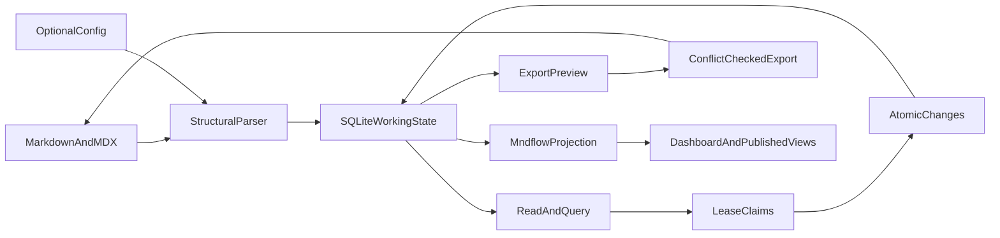

# Markdown Document Ledger MVP

> **Historical.** This document describes the retired ledger MVP. The current product is defined by `README.md`, `translator.md`, and `plan.md`.

## Purpose

Build a local-first shared ledger that imports `.md` and `.mdx` documents into a queryable working store, lets agents claim and revise inferred records safely, and exports staged changes back into the original document structures on an explicit external signal.

The tool does not define project workflows, schedule work, authenticate agents, or replace Git. Agents and external tools decide what records mean and how work is organized.

## Architecture

- Use one TypeScript npm package and one local Node service.
- Treat Git-tracked `.md` and `.mdx` documents as the durable source of truth.
- Use YAML only for optional `mndmap.yaml` configuration and Markdown frontmatter, not as a source-document format.
- Persist imported state, claims, scratch fields, and staged changes in `.mndmap/state.sqlite`.
- Keep all CLI, REST, MCP, dashboard, and export operations on one shared core service.



## Structural import and inference

- Parse Markdown and MDX headings, sections, tables, lists, task items, links, and frontmatter while retaining exact source locations and untouched bytes.
- A collection is a logical ordered set of records, not a physical SQL table. It carries a stable ID, one or more source regions, a fixed source-backed field catalog, a record identity and ordering strategy, configured scratch fields, and adapter capabilities for safe write-back.
- A Markdown table is one source representation of a collection: headers become fields, body rows become records, and cells and complete rows are safely writable.
- Infer a list collection only when at least two sibling items share a consistent record shape and one strong structural signal exists:
  - GFM task checkboxes;
  - repeated labeled child fields such as `Status: queued`;
  - repeated definition-style labels;
  - an explicit configured selector.
- List adapters expose reserved structural fields such as `$checked` and `$text`; the reserved namespace prevents collisions with labels written in the document.
- Nested child lists consumed as fields of an outer record are not also inferred as collections.
- Keep simple prose lists and medium-confidence candidates as ordinary document content, with diagnostics where useful.
- Headings and nested sections retain hierarchy, but repeated sections do not automatically become collections in the MVP; configuration may select them explicitly.
- Frontmatter contributes fields to its document or configured record.
- Do not infer workflow meaning, dependency semantics, ownership semantics, state transitions, enums, or acceptance rules.
- Treat unsupported MDX expressions and ambiguous prose as opaque content that can be read but not surgically rewritten.
- Choose record identity in this order: configured key, explicit source ID, unique table/list value, then stable source locator. Report unstable inferred identities.
- Allow one logical record to map to multiple source locations when configuration identifies repeated keyed representations. Diagnose conflicting source values and update all mapped locations on export.
- Without configuration, every detected table or structured-list region is a separate collection; never merge collections across documents by similarity alone.

### Inferred write capabilities

- Tables support updates to existing cells, record creation, and record deletion.
- Task lists support toggling `$checked`, replacing complete `$text`, and deleting complete items.
- Repeated labeled-child lists support updating existing labeled values and deleting complete items.
- Creating complex list items, adding missing child labels, or editing a substring extracted from `$text` requires explicit configuration.
- Regex extraction may identify a list record key, but extracted substrings remain read-only unless the adapter has a configured safe rendering rule.
- Each collection reports its supported operations and writable fields through the same query surface.

## Optional configuration

`mndmap.yaml` is a partial override for ambiguities; it is not required for ordinary documents. It may define:

- source include/exclude globs;
- collection selectors using document path, heading path, node kind, expected headers or list shape, and an optional occurrence number;
- record identity fields;
- preferred record ordering;
- source-to-API field mappings and writable fields;
- list record shapes and safe creation templates;
- repeated source regions that represent the same logical collection;
- generated document regions or files;
- claim lease defaults;
- the exposed name of the default scratch field;
- additional predefined scratch fields.

Example:

```yaml
version: 1

sources:
  include: docs/**/*.{md,mdx}
  exclude: docs/generated/**

collections:
  work:
    sources:
      - document: docs/plan.md
        select:
          kind: table
          under: [The plan]
          headers: [ID, Status, Waits, Owns]
        key:
          field: ID
        fields:
          id:
            column: ID
          status:
            column: Status
          waits:
            column: Waits
          owns:
            column: Owns
    order: [id]

claims:
  default_lease_seconds: 900

scratch_fields:
  default:
    id: open_field
    alias: implementation_plan
  additional:
    - id: review_notes
      alias: review_notes
```

Scratch aliases must not collide with source-backed field names or with one another.

Configured selectors use document structure rather than line numbers. A selector that unexpectedly matches zero or multiple regions fails clearly instead of guessing. If field mappings are omitted, table headers and repeated list labels remain available under their original names.

Configuration may map multiple tables or lists into one logical collection and normalize differently named source fields to stable API field IDs. Matching configured record keys then identify one logical record with multiple source locations; conflicting values are import diagnostics, never silently resolved.

### Minimal source value model

- Markdown table cells, list text, labeled child values, and section bodies remain Markdown strings.
- `$checked` is the only automatically typed boolean.
- Frontmatter retains the scalar or list structure already supplied by YAML syntax.
- Configuration maps and aliases fields but does not assign workflow semantics or create new source fields.
- Scratch fields remain free-form Markdown strings.

## Closed source schema and scratch fields

- Agents may update existing source-backed fields on records they hold, but may not create source-backed fields or table columns.
- Every inferred collection exposes one predefined SQLite-only free-form field with internal ID `open_field`.
- Configuration may change its exposed alias and declare a small fixed set of additional scratch fields.
- Scratch fields accept free-form Markdown text, require a valid claim to update, persist across service restarts, and are queryable through the same record surface.
- Scratch fields and claims are operational metadata: they never modify or export to source documents.
- Re-import preserves scratch data when record identity remains stable. Missing or unstable records produce diagnostics rather than silently attaching scratch data elsewhere.

## Claims

Use expiring advisory leases backed by SQLite:

- A caller supplies an opaque `ownerId`, record IDs, and requested lease duration.
- One atomic claim request grants every currently available record and reports the denied subset.
- Every granted claim returns a server-generated monotonically increasing fencing token and expiration time.
- Updates to existing records and scratch fields require the current claim token.
- Claims can be renewed or released; release is idempotent and expiration recovers abandoned work.
- Owner IDs are coordination labels, not credentials or authorization.
- Domain fields such as an `Owns` table column remain ordinary document data and are unrelated to ledger claims.

The service supports no fairness guarantees, dependency scheduling, path-overlap scheduling, or automatic batch selection. External agents query and order records, decide what they want, then attempt to claim them.

## Atomic staged changes

- Apply a caller's complete operation list in one short SQLite transaction.
- Support only generic `create`, `update`, and `delete` record operations plus scratch-field updates.
- Require valid fencing tokens for operations on existing records.
- Reject duplicate caller-supplied record IDs.
- Record actor, operation list, and before/after values for review and reversal.
- Mark source-backed changes as pending export; scratch-only changes never enter the export set.
- Commit every operation or none, allowing an external agent to implement compound actions such as splitting a record and retargeting references without a workflow-specific API.

## Query and ordering

- List collections and their inferred fields.
- List/read records in source order by default.
- Support explicit sorting by source-backed fields, raw field-value filters, text search, and claimed/unclaimed filters.
- Return source-backed values, configured scratch fields, claim state, record identity confidence, and staged-change state together.
- Do not interpret readiness, dependencies, ownership, or status values.

## Explicit export

1. Validate that staged operations can be represented in their original source structures.
2. Generate a previewable patch set.
3. Verify every affected file still matches its imported revision.
4. Refuse stale files and report conflicts without overwriting external edits.
5. Refuse export while active claims exist unless explicitly forced.
6. Stage revised files and use a recovery journal while replacing them.
7. Re-import successful output as the new baseline and mark exported changes complete.

Writers update the smallest representable source region—table cell or row, list item, frontmatter value, or section body—and preserve unrelated bytes. Git remains responsible for history and cross-machine merging.

## Minimal surfaces

Implement one shared service and expose it through:

- CLI: `import`, `list`, `claim`, `renew`, `release`, `apply`, `changes`, `export --preview`, and `export`.
- REST and MCP: list collections/records, claim/renew/release records, apply atomic changes, inspect pending changes, and preview/apply export.
- Dashboard: collection list, ordered table/graph views, record detail, scratch editor, claim state, pending-change review, and export conflicts.

The MCP layer is a thin wrapper over the same service methods and validation as the CLI, REST API, and dashboard.

## mndflow compatibility and acceptance

- Project ledger records into mndflow's `Graph`/`Element`/`Edge` envelope through [`src/mndflow/adapter.ts`](src/mndflow/adapter.ts).
- Keep the adapter narrow because mndflow currently has no supported package exports.
- Use the current mndflow Markdown planning documents as the principal fixture:
  - import their tables, lists, sections, repeated IDs, and status glyphs without silent loss;
  - expose ordered records for external agents to interpret and claim;
  - allow claimed agents to place implementation plans and proposed modules/files in configured scratch fields;
  - stage edits to existing source-backed cells and entries;
  - export those edits back to every configured source location;
  - report ambiguous or conflicting repeated records.
- Dependency validation, ownership validation, and next-batch scheduling described by mndflow remain external consumers of the ledger API rather than mndmap behavior.

## Dashboard and publication

- Build a read-first React/Vite dashboard under [`src/ui/`](src/ui/) with `@xyflow/react`.
- Mirror only mndflow design tokens and graph-file semantics rather than copying its application.
- Generate a deterministic SVG, serialized graph JSON, and a small read-only React embed from exported document state.
- Use [`mdsite.yaml`](mdsite.yaml) and [`scripts/publish.mjs`](scripts/publish.mjs) to build the docs and copy the self-contained embed into mdsite output.
- Add [`.github/workflows/docs.yml`](.github/workflows/docs.yml) to test, export publication artifacts, build mdsite, and publish the static directory.

## Scope controls

- No YAML source-document adapter in the MVP.
- No dynamic creation of source or scratch fields by agents.
- No automatic collection inference for simple prose lists or repeated heading sections.
- No automatic merging of collections across source regions.
- No workflow/rules DSL, semantic role system, scheduler, authentication, real-time collaboration, or automatic three-way merge.
- No semantic extraction from arbitrary prose.
- No direct dependency on mndflow internals until it publishes stable package boundaries.
- A single local mndmap service owns the SQLite file; do not place it on a shared network filesystem.

## Implementation sequence

1. Bootstrap TypeScript, SQLite, tests, and configuration loading.
2. Implement Markdown/MDX structural parsing, source maps, table collections, task/repeated-label list collections, identity, adapter capabilities, and conservative diagnostics.
3. Implement SQLite collections, records, predefined scratch fields, staged changes, and deterministic queries.
4. Implement lease claims with expiration and fencing tokens.
5. Implement atomic generic mutations, history, reversal, and claim enforcement.
6. Implement revision-checked format-preserving export and recovery.
7. Expose the shared core through CLI, REST, and MCP.
8. Validate the mndflow documents as an import, claim, scratch, edit, repeated-record, and export fixture.
9. Add the React Flow dashboard and mndflow envelope adapter.
10. Add SVG/interactive publication, mdsite integration, and CI.
