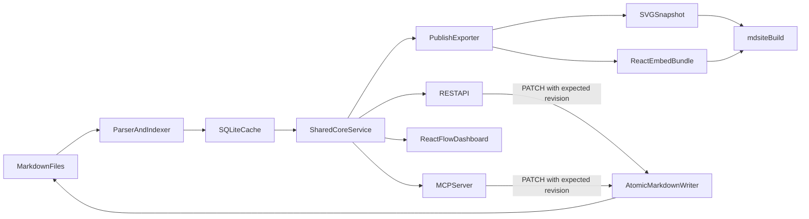

# Markdown Graph MVP

## Simplest viable architecture

- Use one npm package and one Node process—no monorepo, cloud service, authentication system, event bus, or custom workflow engine.
- Treat Git-tracked Markdown as canonical. Store only a rebuildable cache at `.mndmap/index.sqlite`; never synchronize two authoritative stores.
- Model one `.md`/`.mdx` file as one independently writable item. Optional YAML frontmatter supplies stable `id`, `kind`, `status`, `owner`, `parent`, and `relations`; unannotated files still index as generic documents using their relative path and first heading.
- Project indexed items into mndflow's existing `Graph`/`Element`/`Edge` vocabulary through [`src/mndflow/adapter.ts`](src/mndflow/adapter.ts). Do not directly import mndflow yet: its package is private and has no supported exports. Keep the adapter small so a published mndflow core/view package can replace it later.

## Core and safe translation

- Add [`src/core/schema.ts`](src/core/schema.ts), [`src/core/scan.ts`](src/core/scan.ts), and [`src/core/index.ts`](src/core/index.ts) for a deterministic Markdown-to-item-to-graph pipeline. Parse frontmatter, preserve body text byte-for-byte, derive Markdown links as relations, and use SQLite FTS for queries.
- Add [`src/core/write.ts`](src/core/write.ts) for controlled reverse translation. Only update managed frontmatter fields or replace a whole body when the caller supplies the indexed SHA-256 revision. Re-read before writing, return a conflict on mismatch, and commit through an atomic temporary-file rename.
- Serialize writes per file inside the single process. Git remains responsible for history and cross-machine merges; direct external edits are detected by the revision check instead of overwritten.
- Test round trips, deterministic indexing, stale-write rejection, and preservation of unrelated Markdown/MDX content in [`src/core/core.test.ts`](src/core/core.test.ts).

## One shared interface surface

- Add [`src/server.ts`](src/server.ts) with a minimal REST surface: list/query items, fetch one item, fetch the projected graph, rebuild the index, and revision-guarded patch operations.
- Add [`src/mcp.ts`](src/mcp.ts) as a thin stdio MCP wrapper over the same service methods. Expose query, read, and update-owned-item tools; do not create a second data or validation path.
- Add CLI commands in [`src/cli.ts`](src/cli.ts): `index`, `serve`, `mcp`, and `export`.

## Dashboard and mndflow compatibility

- Add a read-first React/Vite dashboard under [`src/ui/`](src/ui/) using `@xyflow/react`: filters/search, item detail, status/owner fields, and the graph view. Editing calls the revision-guarded API.
- Mirror only mndflow's design tokens and graph-file semantics in [`src/ui/theme.css`](src/ui/theme.css); avoid copying its full application. Add a fixture test proving the adapter emits a mndflow-readable envelope. This preserves the eventual extension path without coupling mndmap to unstable source internals.

## Static and interactive publication

- Implement [`src/publish/export.ts`](src/publish/export.ts) to generate from the same graph: a deterministic SVG snapshot, serialized graph JSON, a small read-only React embed bundle, and a generated MDX page containing an iframe with SVG fallback.
- Add [`mdsite.yaml`](mdsite.yaml) and [`scripts/publish.mjs`](scripts/publish.mjs). The script runs the mndmap export, invokes mdsite, then copies the self-contained embed beside mdsite's static output. This gives static hosts an interactive React diagram while retaining an SVG/no-JavaScript artifact and does not require modifying mdsite.
- Add one GitHub Actions workflow at [`.github/workflows/docs.yml`](.github/workflows/docs.yml) to test, export, build with mdsite, and publish the resulting static directory.

## Scope controls

- Support generic requirements, specifications, and tasks through data (`kind` plus arbitrary frontmatter fields), not separate workflows or screens.
- Do not infer rich semantics from prose, add real-time collaboration, or attempt automatic three-way Markdown merges in the MVP. A stale revision produces a clear conflict for the agent or human to re-read and retry.
- Keep the README stretch goal as a later consumer integration: mndflow can ingest the adapter's graph envelope once its schema/package boundary stabilizes.

## Implementation sequence

1. Bootstrap the TypeScript/Vite project and implement the Markdown schema, deterministic scanner, SQLite index, and mndflow graph adapter.
2. Implement revision-guarded atomic Markdown updates and core round-trip/conflict tests.
3. Expose the shared core through REST, CLI, and a thin stdio MCP server.
4. Build the minimal React Flow dashboard with search, item details, and guarded edits.
5. Generate SVG and interactive embed artifacts, integrate mdsite, and add CI verification/publishing.
