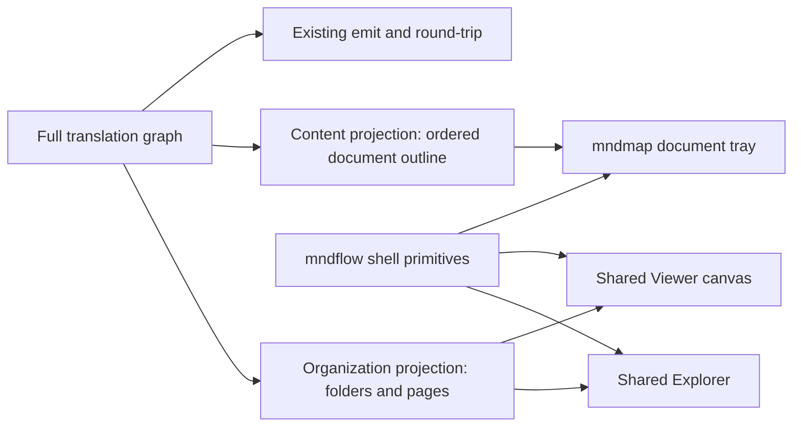

# Coherent mndmap dashboard

## Findings that drive the plan

- mndmap is not currently using the mndflow shell. [src/ui/main.tsx](C:/Users/clayt/Development/mndmap/src/ui/main.tsx) imports only `@mnd/kit/react.css`; the pinned kit exports only `Viewer` and `Explorer`, while mndmap recreates the header/grid in [src/ui/base.css](C:/Users/clayt/Development/mndmap/src/ui/base.css) and the entire tray in [src/ui/Tray.tsx](C:/Users/clayt/Development/mndmap/src/ui/Tray.tsx). The mndflow header, stage chrome, and tray frame remain private to [apps/web/src/App.tsx](C:/Users/clayt/Development/mndflow/apps/web/src/App.tsx), [packages/theme/base.css](C:/Users/clayt/Development/mndflow/packages/theme/base.css), and [packages/tray/src/Tray.tsx](C:/Users/clayt/Development/mndflow/packages/tray/src/Tray.tsx).
- The deep structure is intentional in the current rewrite, not a renderer defect. [src/read.ts](C:/Users/clayt/Development/mndmap/src/read.ts) creates `doc.section`, `doc.item`, and `doc.code` blocks; [mndmap.yaml](C:/Users/clayt/Development/mndmap/mndmap.yaml) maps headings through depth 3; and [src/ui/App.tsx](C:/Users/clayt/Development/mndmap/src/ui/App.tsx) explicitly retains sections in the Explorer while passing the full graph to `Viewer`. This reverses the earlier organization/content split documented in [docs/workflow/organization-and-structure.md](C:/Users/clayt/Development/mndmap/docs/workflow/organization-and-structure.md).
- Explorer integration is also behaviorally out of contract: mndmap treats `reveal` as selection-only and expects `rename.label` / singular `move.id`, while the pinned Explorer emits reveal-as-open-parent, `rename.name`, and plural move arguments. Its create/delete toolbar remains visible even though mndmap does not implement those commands. That makes the tree and canvas drift and leaves inert controls on screen.
- The current tray is a flat dump of identity, tags, fields, rendered body, child pills, and relations. It has no stable context bar, tabs, document order, or construct-specific rendering, so a page reads as an undifferentiated chip cloud rather than a document.
- The 0.6.0 tarball is integrity-pinned, but its bundled CSS matches later mndflow build output rather than what the recorded `abea9d8` source commit reproduces. The replacement release must come from a clean commit so version, source SHA, generated bundle, and integrity describe the same artifact.

## Target architecture



### Design invariants

- **One authoritative graph, two read-only UI projections.** An edit always targets the full graph; organization and content projections are rebuilt after every edit and undo. Neither projection is emitted or saved.
- **Organization means folders and files.** The Explorer and canvas may show `doc.set` and `doc.page` only. The UI projection is re-rooted at the collection's top `doc.set`, so the synthetic `ws` block, sections, items, code blocks, cells, and holders never become organization rows or cards.
- **Content means document order.** Sections and structured constructs remain blocks/holders in the full graph for round-trip fidelity, but appear only through the tray's document projection.
- **Selection has one visible home.** Revealing a folder or page opens its parent layer and selects it there. A content-row selection stays local to the tray and does not point the organization canvas at a hidden block.
- **Structure before relations.** The organization canvas defaults to no content-link edges. An optional page-links display may use a derived edge only when both endpoints resolve to visible pages; section-level duplicates are collapsed by `(from page, to page, type)`, self-links are suppressed, and the Links tab remains the complete account.
- **Shared chrome, project-owned meaning.** mndflow owns shell geometry, bars, icons, collapse/expand behavior, typography, and theme tokens. mndmap owns every word, tab, row type, suggestion, and document action inside that chrome.


## Implementation plan

1. **Create a real general shell seam in mndflow.** Extract composable, graph-agnostic `WorkspaceShell`, `WorkspaceHeader`, and `TrayFrame` primitives from [apps/web/src/App.tsx](C:/Users/clayt/Development/mndflow/apps/web/src/App.tsx), [packages/theme/base.css](C:/Users/clayt/Development/mndflow/packages/theme/base.css), and [packages/tray/src/Tray.tsx](C:/Users/clayt/Development/mndflow/packages/tray/src/Tray.tsx). Use prefixed/scoped classes and slot props for identity, actions, explorer, canvas, optional rail, notice, tray context, tabs, collapse, and full-height behavior. `TrayFrame` is presentational and must not accept `Graph`, `Act`, mndflow tabs, or other model-editor types. Refactor mndflow’s own web app and tray to consume these primitives first, then expose them and `Icon` through `@mnd/kit/shell`, with opt-in CSS at `@mnd/kit/shell.css`, via [packages/kit/package.json](C:/Users/clayt/Development/mndflow/packages/kit/package.json) and [packages/kit/tsup.config.ts](C:/Users/clayt/Development/mndflow/packages/kit/tsup.config.ts). Keep `react.css` suitable for embedded Viewer/Explorer usage; do not export the full editable Stage or model-specific Tray.
2. **Make the Explorer/Viewer consumer contract safe and reducible.** In [packages/explorer/src/Explorer.tsx](C:/Users/clayt/Development/mndflow/packages/explorer/src/Explorer.tsx), add a general capability/slot API so consumers can omit create/delete/filter commands while retaining fold, resize, rename, and move. Replace or augment the untyped external `onAct(name, args)` seam with a discriminated structural intent:
   ```ts
   type ExplorerIntent =
     | { type: "reveal"; id: Id }
     | { type: "rename"; id: Id; name: string }
     | { type: "move"; ids: Id[]; parent: Id; before?: Id };
   ```
   Keep mndflow's arbitrary action registry and context menu internal; default capabilities preserve the mndflow app, while mndmap enables only reveal, rename, move, fold, and resize. Reuse the Stage breadcrumb component in `Viewer` through an opt-in chrome prop so a read-only canvas can have the same navigation treatment without exporting the editable Stage. Cover these additions in mndflow's Explorer, Viewer, shell, and app tests, then release and stamp a new kit version from a clean commit; verify that rebuilding that SHA reproduces the shipped JS/CSS and integrity.
3. **Project one full graph into two mndmap views.** Add a pure UI projection module beside [src/ui/App.tsx](C:/Users/clayt/Development/mndmap/src/ui/App.tsx):
  - `organizationGraph(graph)` re-roots at the top collection set; retains `doc.set` and `doc.page` only; removes content holders; verifies every retained parent and edge endpoint; and optionally derives deduplicated page-level links without mutating source edges.
  - `documentOutline(graph, pageId)` produces emitted-order rows for page prose, nested sections, tables/grids, lists/groups, tasks/records, and code without changing the stored graph. It consumes machine fields such as heading level, row key, and language to render the construct instead of dumping those fields into the primary UI.
  - `pageOf(id)` maps any content block back to its owning page for links and tray context.
   Both functions must be deterministic, cycle-safe, and tolerant of a valid empty page. Feed the same organization projection to both Explorer and Viewer; keep the full graph exclusively for edits, suggestions, tray derivation, validation, and emit.
4. **Correct selection and organization gestures.** Update [src/ui/App.tsx](C:/Users/clayt/Development/mndmap/src/ui/App.tsx) to interpret reveal as “open the node’s parent layer and select it,” consume the typed rename/move payloads, and restrict Explorer gestures to folders/pages. Normalize `layer` and `picked` after each edit/undo so moved or removed nodes cannot leave either surface pointed at an invisible id. A folder may contain folders/pages; a page is a leaf in the organization projection. Page-content reorder, rename, and move actions originate in the tray and target the full graph. This removes hidden canvas selections, inert tree controls, and disagreement between the highlighted row and visible layer.
5. **Rebuild the tray as a document reader inside shared chrome.** Replace the flat implementation in [src/ui/Tray.tsx](C:/Users/clayt/Development/mndmap/src/ui/Tray.tsx) with the shared tray frame and mndmap-owned tabs:
  - **Content:** a linear, emitted-order outline with section depth shown by restrained indentation; markdown prose rendered in place; tables as compact tables; code as code; lists/tasks as lists—not pills or canvas blocks. Rows expand for detail without changing the canvas selection. Section controls permit rename and deterministic reorder among siblings; moving content to another page uses an explicit destination action rather than free-form nesting drag.
  - **Metadata:** source, user-facing frontmatter fields, tags, and suggestion controls grouped into labeled rows. Machine-only fields stay hidden unless they are needed to explain a construct.
  - **Links:** compact inbound/outbound page relations grouped by target and type, with counts and suggestion actions; expanding a group reveals the original content-level relations.
   Folder selection gets a concise child folder/page summary instead of a document outline. Empty pages, missing relation targets, invalid markdown, and no-selection states each get a deliberate empty state. Keep all construct semantics and editing decisions in mndmap; do not add markdown-specific behavior to mndflow.
6. **Adopt the shared visual shell and remove local imitation CSS.** Replace mndmap’s custom header/grid in [src/ui/base.css](C:/Users/clayt/Development/mndmap/src/ui/base.css) with the new shell components and icons, use the same compact icon actions/theme treatment as mndflow, opt into Viewer breadcrumbs, and reduce [src/ui/styles.css](C:/Users/clayt/Development/mndmap/src/ui/styles.css) to document-content styling only. The tray should collapse and open at mndflow’s proportions rather than permanently consuming 38% of the workspace.
   Import only `@mnd/kit/react.css` for Explorer/Viewer paint and the new shell stylesheet for chrome; do not copy the ramp, card table, or React Flow CSS. Prefix mndmap content classes so generic names such as `.body`, `.content`, `.fields`, and `.tray` cannot collide with shared sheets. Preserve the project-specific blank drop target and use the shell's notice slot for reports/errors after loading.
7. **Lock the design with tests and runtime evidence.** Add a `test` script and mndmap unit/component tests proving that organization rows and canvas nodes contain only folders/pages, projections preserve valid parents and document order, reveal synchronizes layer/selection, undo rebuilds both projections, and the tray renders each construct semantically. Test the full-docs sample plus the map and requirements fixtures so dense markdown and typed rows cannot regress independently. Update [vitest.config.ts](C:/Users/clayt/Development/mndmap/vitest.config.ts), the browser driver in [.claude/skills/run-mndmap/driver.mjs](C:/Users/clayt/Development/mndmap/.claude/skills/run-mndmap/driver.mjs), and stale product docs. The command gates are:
   - mndflow: `npm test`, `npm run typecheck`, `npm run build -w @mnd/web`, kit build/release, and release integrity/reproducibility check.
   - mndmap: `npm test`, `npm run typecheck`, `npm run build`, `npm run roundtrip`, and the real-browser smoke suite against all three fixtures.
   Run browser checks at desktop and constrained widths across all themes; compare mndmap and mndflow screenshots for header height, Explorer bar/width, canvas chrome, tray behavior, spacing, borders, and typography. Include keyboard focus, tab semantics, long names, overflow, empty pages, and high-density documents.

## Cross-repository delivery order

1. Capture before screenshots and turn the current integration failures into tests without changing behavior.
2. Implement shared mndflow chrome and Explorer/Viewer contracts; migrate mndflow's own web app onto them and prove no visual or interaction regression there.
3. Commit the mndflow changes, build the kit from that clean SHA, run the release integrity check, and record version/SHA/integrity together.
4. Vendor that exact tarball into mndmap; update `package.json`, lockfile, and `mndflow-pin.json`; prove the installed artifact matches the release before changing mndmap UI code.
5. Implement and test mndmap's pure projections, then correct interaction state, then build the tray, and only then remove the local shell imitation.
6. Run the complete headless and browser verification matrix; update screenshots and documentation only from the verified final behavior.

Each repository remains independently green at its handoff. Do not develop mndmap against an uncommitted sibling package or publish a kit whose source SHA cannot reproduce it.

## Acceptance criteria

- Explorer contains one collection root plus folders and pages; no row is a section, item, table cell, code fence, holder, or synthetic `ws` block.
- Viewer receives the same organization projection and never draws a content block. Selecting any Explorer row makes that row visible and selected on the canvas.
- Explorer exposes no inert create/delete/filter controls. Rename and multi-item move use the typed payloads and work through undo.
- A selected page opens a tray whose Content tab reads in emitted order and visually distinguishes headings, prose, tables, lists/tasks, code, and typed records without raw ids or machine fields.
- Metadata and Links are separate questions, not appended below the document body. Suggestions appear beside the value they would change.
- Header, Explorer bar, canvas chrome, tray bar/tabs, controls, borders, spacing, typography, themes, collapse/full-height behavior, and responsive overflow are shared with or visually identical to mndflow.
- `@mnd/kit/react.css` remains sufficient for embedded Viewer/Explorer users; shell adoption is opt-in and does not globally impose the full app layout.
- Translate → dashboard edit → undo → emit and all existing round trips remain byte-stable where no edit was made. The full graph still opens directly in mndflow without conversion.
- The new kit rebuilds reproducibly from its recorded clean commit, and mndmap's pin records the exact version, SHA, tarball, and integrity in use.

## Ownership boundary

- **mndflow changes:** generic shell/header/tray-frame chrome, icons, optional Viewer breadcrumbs, and a typed/capability-aware Explorer seam.
- **mndmap changes:** organization/content projections, which nodes are visible, page-link aggregation, document semantics, tray tabs/renderers, suggestions, and edit rules.
- **No mndflow change needed:** Graph schema, projection/layout algorithms, card notation/theme ramp, or a markdown-aware tray. Those are already general or correctly project-specific.

