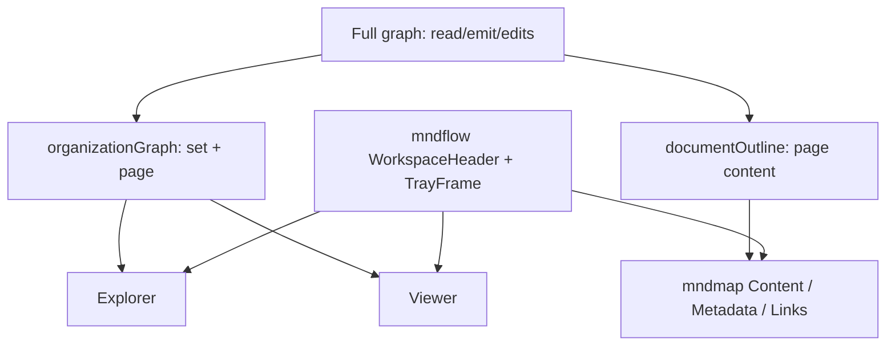

# Revised coherent mndmap dashboard

Prior proposal: [plan.md](plan.md). This document is the execution plan.

---

## Diagnosis (answers to the “why” questions)

### Why it looks different and ugly

mndmap is **not** running the mndflow shell. It imports only `@mnd/kit/react` (`Viewer`, `Explorer`) and `@mnd/kit/react.css`, then invents its own chrome:

- Custom 3-panel grid and header in [src/ui/base.css](src/ui/base.css) / [src/ui/App.tsx](src/ui/App.tsx) (tray permanently ~38% height; text buttons; no icon bar).
- Entire tray reinvented in [src/ui/Tray.tsx](src/ui/Tray.tsx) + [src/ui/styles.css](src/ui/styles.css) — flat dump of tags, fields, markdown body, **child pills**, relations.
- mndflow’s real shell lives in [`apps/web/src/App.tsx`](https://github.com/kotulc/mndflow/blob/abea9d84a651ff5722145b4477e9b4f5d780f15c/apps/web/src/App.tsx) + [`packages/theme/base.css`](https://github.com/kotulc/mndflow/blob/abea9d84a651ff5722145b4477e9b4f5d780f15c/packages/theme/base.css) + [`packages/tray/src/Tray.tsx`](https://github.com/kotulc/mndflow/blob/abea9d84a651ff5722145b4477e9b4f5d780f15c/packages/tray/src/Tray.tsx) (pin SHA from [mndflow-pin.json](mndflow-pin.json)). Kit `react.css` **does not** include `base.css` or tray CSS (see [`packages/kit/tsup.config.ts`](https://github.com/kotulc/mndflow/blob/abea9d84a651ff5722145b4477e9b4f5d780f15c/packages/kit/tsup.config.ts): icons + flow/routes/groups + explorer only).

Cards/explorer paint can match; **layout chrome cannot**, until a shared shell seam exists.

### Why deeply nested blocks appear

Not a renderer bug. [src/read.ts](src/read.ts) intentionally builds a **content graph**: nested `doc.section` (heading depth ≤ 3), plus `doc.item` / `doc.code` / grid-group holders under pages. That graph is correct for emit/round-trip.

The UI mistake: [App.tsx](src/ui/App.tsx) keeps **sections in Explorer** and passes the **full graph to Viewer**, so opening a page shows sections → items → cells as canvas cards. Product docs ([docs/workflow/organization-and-structure.md](docs/workflow/organization-and-structure.md)) say organization = folders/pages only; sections belong in a **document outline tray** — a linear indent stack in emitted order, not a nested canvas.

### Why the tray is unintelligible

Current tray answers every question at once (identity + tags + fields + body + child navigation pills + relations) with no tabs, no document order, and no construct-specific rendering. Child buttons re-navigate the canvas into content layers — amplifying the nesting mess.

### What must change in mndflow (general only)

| Needed in mndflow | Not needed in mndflow |
|---|---|
| Extract graph-agnostic `WorkspaceHeader`, `TrayFrame`, shell CSS (`@mnd/kit/shell` + `shell.css`) | Markdown/document semantics, Content/Metadata/Links tabs |
| Explorer `tools` / capability flags to hide create/delete/filter | Organization vs content projections |
| Opt-in Viewer breadcrumbs (reuse Stage `Crumbs` via `project().trail`) | Page-link aggregation, suggest chips |
| Keep/clarify `onAct` rename=`name`, move=`ids`+`before` (document + tests); typed intent adapter optional | Graph schema, layout algorithms, card ramp |

---

## Gaps and issues in [plan.md](plan.md)

1. **Blocks all mndmap UI work on a new kit release.** Org projection, reveal/rename/move fixes, and tray rebuild work against kit **0.6.0 today**. Shell chrome alone needs the new kit. Parallel tracks get coherence weeks faster.
2. **Underspecifies the smoking-gun wiring bugs.** Explorer emits `rename.name` and `move.ids`/`before`; mndmap listens for `label` / singular `id` / `at` — so tree rename and drag **never run**. `reveal` only sets `picked`, not `layer`. Agents need explicit adapter code.
3. **`menu={false}` does not hide the toolbar.** Create/delete/filter stay visible; need an Explorer `tools` prop (or equivalent) in mndflow.
4. **`react.css` contents wrong implicitly.** Plan says “import react.css + shell.css” but never lists that shell must ship `base.css` layout tokens (`--bar`), header rules, and tray-frame CSS that kit currently omits.
5. **`documentOutline` / `organizationGraph` algorithms underspecified** for agents (root re-rooting, notes under `doc`, holders, machine fields, edge filtering).
6. **Page-link edges left “optional.”** Lock: **no org-canvas edges in v1**; Links tab is the full account.
7. **Tray edit scope too large for one step.** Split: readable outline first; then sibling reorder/rename; defer cross-page move.
8. **No `npm test` / live `test/` tree** in mndmap. Plan assumes tests without bootstrap steps.
9. **Weak agent checklist:** missing file-level DoD, driver command expectations, screenshot paths, CSS prefix (`mm-`), and skill updates (`rows` must become set+page only).
10. **Over-weights typed `ExplorerIntent` as a gate.** A thin mndmap adapter unblocks immediately; typed intents can follow in mndflow without blocking coherence.

What `plan.md` got right (retain): one authoritative graph + two UI projections; shared chrome / project-owned meaning; ownership boundary; kit integrity/reproducibility; do not put markdown into mndflow.

---

## Locked decisions

- **Org surfaces** (`Explorer` + `Viewer`): `doc.set` + `doc.page` only. No sections, items, code, holders, notes, or synthetic extra roots as rows/cards. Re-root display at collection root `doc` (`TIER_ROOT`).
- **Content surface** (tray Content tab): emitted-order outline for the selected **page** (or folder summary for a set). Nesting = indentation, not canvas descent.
- **Selection model:** `picked` / `layer` always refer to org ids visible on the projection. Tray may hold a local `focusId` for an outline row **without** changing Viewer layer to that content id.
- **Org canvas edges:** none in v1.
- **Shell adoption:** after new kit is vendored; until then, tray can use a **local** `TrayFrame` markup that mirrors mndflow class names so swap is mechanical.
- **Translate/emit/read graph:** unchanged. Projections are UI-only.



---

## Delivery: two tracks, then merge

### Track A — mndmap coherence (current kit 0.6.0)

Do **not** wait for a new kit.

### Track B — mndflow general shell (real mndflow repo)

Ship kit ≥0.7.0 with shell + Explorer tools + Viewer crumbs.

### Merge — vendor kit, swap local chrome, delete imitation CSS

---

## Track A — mndmap (execute first / in parallel)

### A0. Baseline evidence (no behavior change)

**Files:** screenshots under `%TEMP%/mndmap-shots/before-*`; optional failing tests in `test/`.

**Agent steps:**

1. `npm run build` + smoke with [run-mndmap](.claude/skills/run-mndmap/SKILL.md): `rows`, `boxes`, `ss before-home`, click a page, `tray`, `ss before-page`.
2. Record in the PR/notes: Explorer shows sections; Viewer shows content cards; rename from tree does nothing.

**Done when:** before screenshots exist and known failures are listed.

### A1. Fix Explorer intent adapter (one file)

**File:** [src/ui/App.tsx](src/ui/App.tsx) `act` callback.

**Replace handler semantics with:**

```ts
if (name === "reveal") {
  const parent = graph.blocks[id]?.parent ?? TIER_ROOT;
  setLayer(parent);      // open parent layer so the card is visible
  setPicked([id]);
  return;
}
if (name === "rename" && typeof args?.name === "string") {
  edit({ do: "rename", id, name: String(args.name) });
  return;
}
if (name === "move" && args?.parent && Array.isArray(args.ids)) {
  for (const moveId of args.ids as Id[]) {
    edit({ do: "move", id: moveId, parent: String(args.parent),
      ...(args.before ? { /* resolve before → at via sibling index */} : {}) });
  }
}
// ignore create / delete / filter / shelve
```

**Also:** map Explorer `before` id → `at` index using `children(graph, parent)` order (edits API uses `at?: number`).

**Done when:** browser rename + drag-move update graph; undo restores; create/delete clicks are no-ops (still visible until Track B).

### A2. `organizationGraph` + wire Explorer/Viewer

**New file:** `src/ui/project.ts` (pure).

**`organizationGraph(graph): Graph` algorithm:**

1. Start from `TIER_ROOT` (`"doc"`). Include that block if type is `doc.set`.
2. BFS/DFS children; keep only blocks whose type is `doc.set` or `doc.page`.
3. For each kept block, set `parent` to nearest kept ancestor (skip removed section/item ancestors). Preserve relative sibling order among kept siblings (stable sort by original `order`).
4. Copy defs/packages needed by retained types; drop all holders; drop all edges (v1).
5. Drop notes and any block not reachable from root through kept parents.
6. Cycle-safe; empty collection → root set only.

**Wire:** both `<Explorer graph={org} …>` and `<Viewer graph={org} …>` use the same projection. Edits still `apply` against `loaded.graph` (full). After every edit/undo, rebuild `org` via `useMemo`.

**Normalize selection:** if `picked`/`layer` not in `org.blocks`, reset `layer` to `TIER_ROOT` and clear or repair `picked`.

**Done when:** `rows` shows only sets/pages; `boxes` all on panel; descending into a page shows **empty or only nested sets/pages**, never sections.

**Tests:** `test/project.test.ts` with fixture graphs from `fixtures/map` and a tiny hand-built nest (set→page→section→item) asserting section/item absent and page.parent === set.

### A3. `documentOutline` + page ownership

**Same file:** `src/ui/project.ts`.

**Types (lock):**

```ts
type OutlineRow =
  | { kind: "section"; id: Id; depth: number; title: string; level?: number }
  | { kind: "prose"; id: Id; depth: number; markdown: string }
  | { kind: "table"; id: Id; depth: number; headers: string[]; rows: string[][] }
  | { kind: "list"; id: Id; depth: number; items: { id: Id; text: string; done?: boolean }[] }
  | { kind: "code"; id: Id; depth: number; language?: string; text: string }
  | { kind: "record"; id: Id; depth: number; label: string; fields: { name: string; value: string }[] };
```

**`documentOutline(graph, pageId)`:** walk page children in **emit order** (reuse ordering rules from [src/emit.ts](src/emit.ts) child walk — extract shared helper or mirror). Sections increment depth; do not emit machine fields (`level`, `lang`, …) as UI rows — use them to choose `kind`. Holders `grid`/`group` become `table`/`list` rows.

**`pageOf(graph, id)`:** walk parents until `doc.page` or null.

**Done when:** unit tests cover empty page, nested sections, table, fence, list-as-group.

### A4. Rebuild tray (document reader)

**Rewrite:** [src/ui/Tray.tsx](src/ui/Tray.tsx), [src/ui/styles.css](src/ui/styles.css).

**Structure (mirror mndflow tray chrome locally until Merge):**

- Outer `section.tray.open` + `div.tray-bar` (context word/name) + collapse control + `div.tray-body` + tabs.
- Tabs: **Content | Metadata | Links** (folder selection: Content = child folder/page list only).

**Content tab:**

- If page: render `documentOutline` as a vertical list; indent `depth * 12–16px`; section = heading row; prose = rendered markdown; table = `<table>`; code = `<pre>`; list = `<ul>`/`<ol>`.
- Row click sets **tray-local** `focusId` only (expand details). **Do not** call `onLook` into content ids.
- Empty page: deliberate empty state (“This page has no mapped content.”).
- Reference UX: linear stack with indent for nesting (not a collapsible tree).

**Metadata tab:** source path; user-facing fields only (hide `level`/`lang`/internal keys unless explaining a construct); tags + suggestion chips beside the value they change.

**Links tab:** group relations by `(otherPageId, type)`; show count; expand for underlying content-level edges; missing targets show “gone”.

**CSS:** prefix all mndmap content classes with `mm-` (e.g. `.mm-outline`, `.mm-prose`). Do not use bare `.body` / `.content` / `.tray` selectors that collide with future shell.css — local frame may use mndflow’s `.tray` / `.tray-bar` class names **only** when copying tray-frame CSS verbatim.

**Edits in v1 tray:** rename (page/section title), tags, relation type pick, suggestion pick. **Sibling reorder** (`edit order`) in Content tab = A4b follow-on. **Cross-page content move** = later; not in this plan’s acceptance.

**Done when:** selecting a dense page (docs or `fixtures/req`) reads as a document; no pill cloud of children; Suggestions sit next to values.

### A5. Test bootstrap + driver/skill updates

**Add:** `"test": "vitest run"` to [package.json](package.json); create `test/project.test.ts`, `test/tray.test.tsx` (rtl if needed — add `@testing-library/react` + jsdom only if component tests require it; prefer pure projection tests first).

**Update:** [.claude/skills/run-mndmap/SKILL.md](.claude/skills/run-mndmap/SKILL.md) — `rows` must be sets/pages **only** (remove “sections”); tray dump should describe tabs.

**Update driver** if tray selectors change.

**Done when:** `npm test`, `npm run typecheck`, `npm run roundtrip`, browser smoke all green.

---

## Track B — mndflow (general components only)

Work in the real [mndflow](https://github.com/kotulc/mndflow) repo (paths below are relative to that tree; pin SHA in [mndflow-pin.json](mndflow-pin.json)).

### B1. Extract shell primitives

**New package or kit entry** (prefer kit export to avoid new package churn):

- `packages/theme/src/shell.tsx` (or `packages/kit/src/shell.tsx`):
  - `WorkspaceHeader({ brand, where, children/tools })`
  - `TrayFrame({ open, onOpen, big?, onBig?, word, name, note?, tabs, tab, onTab, tools?, children })`
- CSS: assemble `shell.css` from relevant parts of `theme/base.css` (header, `--bar`, `.app` grid **as a documented optional layout**) + tray **frame** rules from `tray.css` (bar/body/tabs/open/shut/big) — **not** model tab bodies.
- Refactor mndflow `App.tsx` + `Tray.tsx` to consume these primitives first (dogfood).
- Export via `@mnd/kit/shell` + `@mnd/kit/shell.css`; export `Icon` from shell or react entry.
- **Do not** put `Graph`/`Act` into `TrayFrame`.
- Keep `@mnd/kit/react.css` for embedders; shell is opt-in.

**Done when:** mndflow web app looks unchanged; `npm test` / typecheck / build green in mndflow.

### B2. Explorer consumer tools API

**File:** [`packages/explorer/src/Explorer.tsx`](https://github.com/kotulc/mndflow/blob/abea9d84a651ff5722145b4477e9b4f5d780f15c/packages/explorer/src/Explorer.tsx).

Add prop, default preserves mndflow:

```ts
tools?: {
  filter?: boolean; // default true (still stub)
  create?: boolean; // default true
  remove?: boolean; // default true
  fold?: boolean;   // default true
};
```

When false, omit those buttons. `menu={false}` remains context-menu only.

**Tests:** explorer.test.tsx — with `tools={{ create:false, remove:false, filter:false }}` those buttons absent; fold still present; rename/move still fire with `name` / `ids`/`before`.

**Document** Act payloads in explorer README (reveal/rename/move) so consumers cannot reintroduce `label`/`at` mistakes.

### B3. Viewer breadcrumbs

**File:** [`packages/kit/src/viewer.tsx`](https://github.com/kotulc/mndflow/blob/abea9d84a651ff5722145b4477e9b4f5d780f15c/packages/kit/src/viewer.tsx).

Add `chrome?: { crumbs?: boolean }` (default false). When true, wrap `FlowView` like Stage: render `Crumbs` from `project(graph, layer).trail`; crumb click → `onLook` / equivalent.

Extract shared `Crumbs` if needed so Stage and Viewer do not diverge (prefer move to `@mnd/theme` or small shared module — still general).

### B4. Release kit cleanly

1. Commit on a clean SHA.
2. Build kit; pack tarball; compute integrity.
3. Rebuild from that SHA in a clean tree; confirm bit-identical JS/CSS/integrity.
4. Record version (e.g. 0.7.0), SHA, tarball name, integrity together.

**Done when:** reproducibility check scripted and passing.

---

## Merge — mndmap adopts shell

1. Copy tarball to `vendor/`; update [package.json](package.json), lockfile, [mndflow-pin.json](mndflow-pin.json).
2. Verify installed package integrity matches pin **before** UI edits.
3. [main.tsx](src/ui/main.tsx): `import "@mnd/kit/react.css"; import "@mnd/kit/shell.css";` then only `mm-` content CSS.
4. Replace local header/grid/tray-frame with `WorkspaceHeader` + `TrayFrame`; pass `tools={{ create:false, remove:false, filter:false }}`; enable Viewer crumbs.
5. Delete imitation layout from `base.css` (keep blank-drop + `mm-` overrides only).
6. Tray open height must follow shell (≈25%, collapsible, optional big) — not fixed 38%.
7. Screenshot matrix: desktop + narrow; themes retro/modern/light; compare header height, explorer bar, tray bar to mndflow.
8. Update README / interactive-workspace docs that still say kit 0.2.0 or REST UI.

**Done when:** acceptance criteria below all pass.

---

## Acceptance criteria (executable)

- Explorer rows = collection root + `doc.set` + `doc.page` only (driver `rows`).
- Viewer nodes = same set; no content cards (`boxes` all on panel; manual/ss check).
- Reveal opens parent layer and selects the row; tree highlight matches canvas.
- Tree rename uses `args.name`; multi-move uses `args.ids`; both undo.
- No create/delete/filter buttons (after Merge); before Merge they may exist but must no-op.
- Page tray Content tab is emitted-order outline with distinct section/prose/table/list/code rendering; no child pill cloud; no raw ids as primary UI.
- Metadata and Links are separate tabs; suggestions adjacent to target values.
- Visual chrome matches mndflow header/explorer/tray proportions after Merge.
- `npm run roundtrip` byte-stable when no edits; full graph still valid for mndflow.
- Pin records version + SHA + tarball + integrity; rebuild reproduces.

---

## Agent execution rules

- **Do not** change [src/read.ts](src/read.ts) / [src/emit.ts](src/emit.ts) schema for this plan.
- **Do not** add markdown-awareness to mndflow.
- **Do not** develop mndmap against an uncommitted sibling `node_modules` link for the Merge pin; use the packed tarball.
- Prefer Track A2+A4 for user-visible coherence even if Track B is delayed.
- Every Track A PR: `npm run typecheck` + `npm run roundtrip` + browser smoke.
- Every Track B PR: mndflow `npm test` + typecheck + web build + dogfood screenshot.

---

## Suggested PR sequence

1. A0+A1 (adapter) — small, unblocks gestures
2. A2+A3 (projections) — fixes nested canvas
3. A4 (tray) — fixes intelligibility
4. A5 (tests/skill)
5. B1–B4 (mndflow release)
6. Merge (vendor + shell swap + CSS delete + docs)
